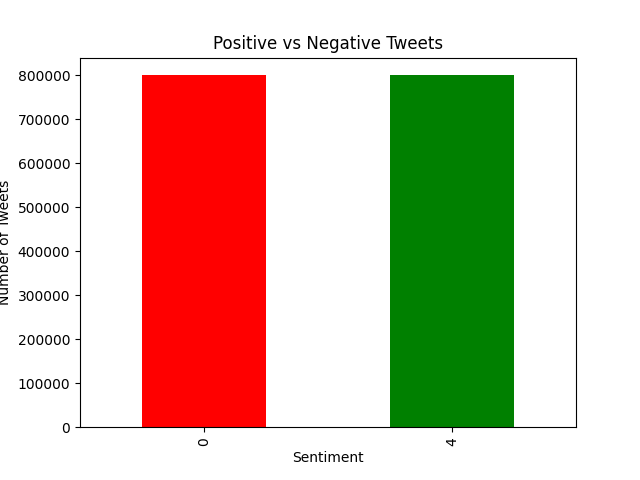
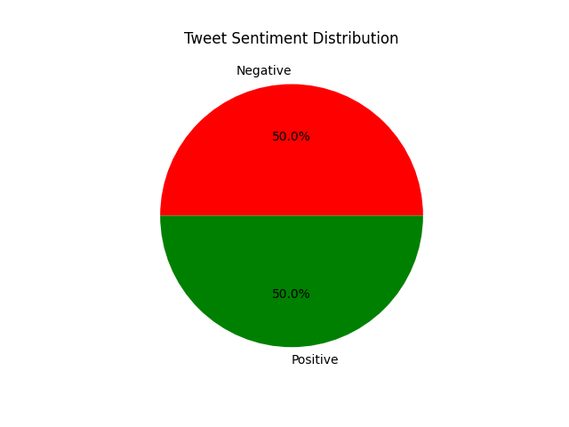

# Twitter Sentiment Analysis

Analyzing 1.6 million real tweets to understand positive and negative sentiment on social media.

---

## About This Project

This project analyzes the Sentiment140 dataset containing 1.6 million tweets collected from Twitter. The raw data was loaded, cleaned, and filtered to classify tweets into two categories:

- Negative tweets (label = 0)
- Positive tweets (label = 4)

The analysis reveals that the dataset is perfectly balanced, exactly 50% positive and 50% negative tweets.

---

## Visualizations

### Bar Chart - Positive vs Negative Tweets

### Pie Chart - Tweet Sentiment Distribution

---

## Key Findings

- Total tweets analyzed: 1,600,000
- Negative tweets: 800,000 (50%)
- Positive tweets: 800,000 (50%)
- The dataset is perfectly balanced between positive and negative sentiment

---

## Libraries Used

- Pandas - for loading and filtering the raw data
- Matplotlib - for creating bar chart and pie chart visualizations

---

## How to Run

1. Clone this repository
2. Download the Sentiment140 dataset from Kaggle
3. Install dependencies:

pip install pandas matplotlib

4. Update the file path in analysis.py to match your dataset location
5. Run the script:

python analysis.py

---

## Project Structure

- analysis.py - main Python script
- bar_chart.png - bar chart visualization
- pie_chart.png - pie chart visualization
- README.md - project documentation

---

## Author

Sahithi Morla
GitHub: https://github.com/SahithiMorla123
Email: sahithisaim28@gmail.com
